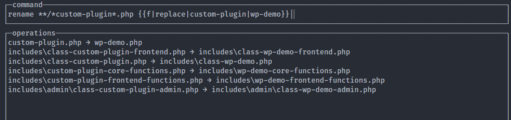

# WordPress Plugin Boilerplate with Gulp
A Wordpress starter pack with pre-configured Gulp to setup custom Wordpress Plugin Boilerplate in a minute.

## How to Setup
Download or clone this repository and run `npm install` command to install all the required packages.  
After finishing the packages installation you'll have to rename file names and file keywords. This boilerplate use `Custom Plugin` keyword with various transform.

**Used keywords in plugin**

Keyword | Description
---|---
custom-plugin |  Filename prefix/posfix which is used for main plugin file name and class and functions php files.
Custom Plugin | Plugin name used in main plugin file and gulp file.
Custom_Plugin | Final class name and prefix for other classes. Also used for package info in comment doc. 
CUSTOM_PLUGIN | Prefix for defined CONSTANTS
custom-plugin | Used for WordPress text-domain and enqueue script/style name prefix.
custom_plugin | Used for main function name and as other functions name prefix.

___

You can either manually rename each file names and keywords as per your plugin name or you can use following `CLI` based methods to do rename and replace task quickly.

**Rename file names**

To rename files quickly you can use [rename-cli](https://www.npmjs.com/package/rename-cli) package.

`npm install --global rename-cli` run this command to install the cli package globally then in your plugin directory root folder run the cli command `rename`

> **NOTE:** Windows users (or anyone who wants to type one less letter) can use `rname` instead of rename since the rename command already exists in Windows

After running the command you'll see the interface to type some command text.  
Type `**/*custom-plugin*.php {{f|replace|custom-plugin|wp-demo}}` text there and you'll see this kind of filtered result.

`wp-demo` is the keyword which were replacing with `custom-plugin` keyword. You can use your plugin name/keyword in place of `wp-demo`, then press `Enter` and choose `Run the command` option. You files will be renamed.

**Replace keywords in files**

To replace keywords in files quickly you can use [replace-in-files-cli](https://www.npmjs.com/package/replace-in-files-cli) package.

`npm install --global replace-in-files-cli` run this command to install the cli package globally then in your plugin directory root folder run the following commands:

`replace-in-files --string='Custom Plugin' --replacement='WP Demo' '**/*.php' 'package.json' 'bower.json' 'gulpfile.js'`

`replace-in-files --string='Custom_Plugin' --replacement='WP_Demo' '**/*.php' 'package.json' 'bower.json' 'gulpfile.js'`

`replace-in-files --string='CUSTOM_PLUGIN' --replacement='WP_DEMO' '**/*.php' 'package.json' 'bower.json' 'gulpfile.js'`

`replace-in-files --string='custom-plugin' --replacement='wp-demo' '**/*.php' 'package.json' 'bower.json' 'gulpfile.js'`

`replace-in-files --string='custom_plugin' --replacement='wp_demo' '**/*.php' 'package.json' 'bower.json' 'gulpfile.js'`

> **NOTE:** Use your plugin name related keywords in place of `WP Demo` `WP_Demo` `WP_DEMO` `wp-demo` `wp_demo`

## Files structure

├── assets  
├── src  
│  ├── fonts  
│  ├── images  
│  ├── css  
│  │  ├── admin.scss  
│  │  └── frontend.scss  
│  ├── js  
│  │  ├── admin.js  
│  │  └── frontend.js  
│  └── manifest.json  
├── includes  
│  ├── admin  
│  │  └── class-custom-plugin-admin.php  
│  ├── class-custom-plugin-frontend.php  
│  ├── class-custom-plugin.php  
│  ├── custom-plugin-core-functions.php  
│  └── custom-plugin-frontend-functions.php  
├── languages  
│  └── custom-plugin.pot  
├── custom-plugin.php  
└── gulpfile.js  

`custom-plugin.php` is the main plugin file which contains all the plugin informations and some defined CONST and global function with main Class file instance call.

`gulpfile.js` has all all the task setup for `js, css, images, fonts`

`languages` directory contains .pot file which is useful for translation.

`includes` directory contains all the php files. Class based files will start `class-` prefix and functions files will end with `-functions.php` postfix. All the backend related files will be inside `admin` directory.

`src` directory contains all the source files for plugin assets. `js, css, images, fonts` files will be in related directory. This setup use [asset-builder](https://www.npmjs.com/package/asset-builder) package, you can read about if you have any problem with assets files set up.

`assets` directory contains all the compressed & optimized `js, css, images, fonts` files. you don't write anything in directory it will auto-generated with the help of `Gulp`.

## Start Development

Run `npm start` to start development. `gulp watch` task will be started and as soon as you'll make changes on your assets files, your new assets will be generated automatically.

## Build

Run `npm run build` to build the final assets & .pot file.

## Author

**Vijay Hardaha** [(Full stack web developer)](https://pph.me/vijayhardaha)

- Twitter: [https://twitter.com/vijayhardaha](https://twitter.com/vijayhardaha)
- Linkedin: [https://www.linkedin.com/in/vijayhardaha](https://www.linkedin.com/in/vijayhardaha/)